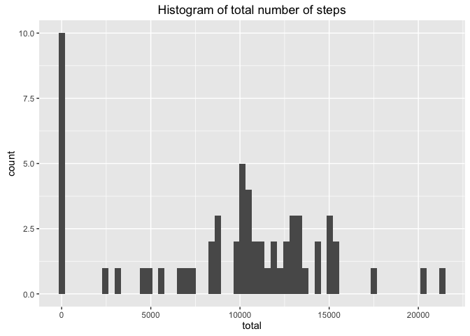
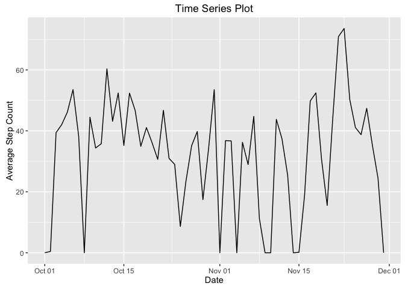
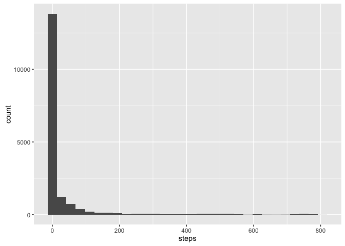
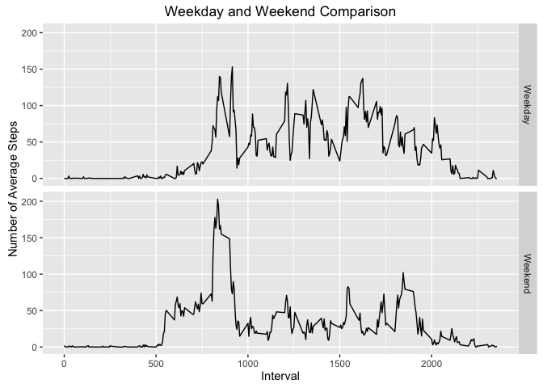

# Reproducible Research: Peer Assessment 1


## Loading and preprocessing the data
In order to complete the assignment, we are going to need some libraries to be 
loaded into the R environment.  

1. lubridate
2. dplyr
3. ggplot2
4. knitr
5. rmarkdown

We shall also set some default variables so we can use them throughout the 
exercise.


```r
# Required packages
packages <- c('lubridate', 'dplyr', 'ggplot2', 'knitr', 'rmarkdown')

# Default variables
dataURL <- 'https://d396qusza40orc.cloudfront.net/repdata%2Fdata%2Factivity.zip'
dataFolder <- file.path(getwd(), 'data/')
filename <- 'activity.zip'
extractedFile <- 'activity.csv'

# Checking packages are downloaded and are loaded in environment.
missingPackages <- packages[(!(packages %in% installed.packages()))]
if(length(missingPackages) > 0)
  install.packages(missingPackages)

if(!all(unlist(lapply(packages, require, character.only = TRUE))))
  stop('Cannot install packages. Quitting...')
```
We also need some functions to help with the processing, namely:

* checkPackages() - to load required packages into the R environment.
* loadData() - to download and load the data into the R environment.
* cleanData() - to clean the data as part of the data analysis.

Let's set these up now...

```r
# Function to download and load dataset. Returns loaded dataset
loadData <- function() {
  fullFileName <- file.path(dataFolder, filename)
  
  dir.create(dataFolder, showWarnings = FALSE)
  #  download.file(dataURL, fullFileName)
  unzip(zipfile = fullFileName, exdir = dataFolder, files = extractedFile)
  
  # Return dataset
  tbl_df(read.csv(file.path(dataFolder, extractedFile)))
}

# Function to clean the loaded data set and to specification. Returns 
# cleaned data set 
cleanData <- function(data_file, valueOfNASteps) {
  # Clean up the dates usling lubridate and replace NA in steps field
  # with value in valueOfNASteps argument
  
  data_file$date <- ymd(data_file$date)
  if(!missing(valueOfNASteps))
    data_file$steps <- replace(
      data_file$steps, which(is.na(data_file$steps)), 
      valueOfNASteps)
  
  data_file
}
```
With the above done, we need to load the data set into the environment and make
it ready to answer the exercise questions. Let's load the original data set, 
and a cleaned data sets that sets the **NA** values of **step** to the value
**zero**.


```r
# Loading the original data set into the dataSet variable
dataSet <- loadData()

# Cleaning steps in original data set by replacing NA with 0
dataFile <- cleanData(dataSet, 0)
```
So with the preprocessing done, let's try and answer some of the questions.

## 1. What is mean total number of steps taken per day?
Having set the **NA** values to **zero**, we have the total number of steps 
as 570608 steps. 

We can calculate the mean number of steps for each day as below: 


```r
totalsteps <- dataFile %>% group_by(date) %>% 
  summarise(total = sum(steps, na.rm = TRUE))

data.frame(totalsteps) # To print out full list.
```

```
##          date total
## 1  2012-10-01     0
## 2  2012-10-02   126
## 3  2012-10-03 11352
## 4  2012-10-04 12116
## 5  2012-10-05 13294
## 6  2012-10-06 15420
## 7  2012-10-07 11015
## 8  2012-10-08     0
## 9  2012-10-09 12811
## 10 2012-10-10  9900
## 11 2012-10-11 10304
## 12 2012-10-12 17382
## 13 2012-10-13 12426
## 14 2012-10-14 15098
## 15 2012-10-15 10139
## 16 2012-10-16 15084
## 17 2012-10-17 13452
## 18 2012-10-18 10056
## 19 2012-10-19 11829
## 20 2012-10-20 10395
## 21 2012-10-21  8821
## 22 2012-10-22 13460
## 23 2012-10-23  8918
## 24 2012-10-24  8355
## 25 2012-10-25  2492
## 26 2012-10-26  6778
## 27 2012-10-27 10119
## 28 2012-10-28 11458
## 29 2012-10-29  5018
## 30 2012-10-30  9819
## 31 2012-10-31 15414
## 32 2012-11-01     0
## 33 2012-11-02 10600
## 34 2012-11-03 10571
## 35 2012-11-04     0
## 36 2012-11-05 10439
## 37 2012-11-06  8334
## 38 2012-11-07 12883
## 39 2012-11-08  3219
## 40 2012-11-09     0
## 41 2012-11-10     0
## 42 2012-11-11 12608
## 43 2012-11-12 10765
## 44 2012-11-13  7336
## 45 2012-11-14     0
## 46 2012-11-15    41
## 47 2012-11-16  5441
## 48 2012-11-17 14339
## 49 2012-11-18 15110
## 50 2012-11-19  8841
## 51 2012-11-20  4472
## 52 2012-11-21 12787
## 53 2012-11-22 20427
## 54 2012-11-23 21194
## 55 2012-11-24 14478
## 56 2012-11-25 11834
## 57 2012-11-26 11162
## 58 2012-11-27 13646
## 59 2012-11-28 10183
## 60 2012-11-29  7047
## 61 2012-11-30     0
```
We can also make a __histogram__ of the above totals to make it easier to 
visualise: 


```r
totalsteps %>% ggplot(aes(total)) + geom_histogram(binwidth = 350) + 
  ggtitle('Histogram of total number of steps')
```

<!-- -->
Let's also calculate the mean and median for each day and save it. It may come 
in handy later on...


```r
summaryData <- dataFile %>% group_by(date) %>% 
  summarise(total = sum(steps), 
            mean = mean(steps), 
            median = median(steps))

data.frame(summaryData)
```

```
##          date total       mean median
## 1  2012-10-01     0  0.0000000      0
## 2  2012-10-02   126  0.4375000      0
## 3  2012-10-03 11352 39.4166667      0
## 4  2012-10-04 12116 42.0694444      0
## 5  2012-10-05 13294 46.1597222      0
## 6  2012-10-06 15420 53.5416667      0
## 7  2012-10-07 11015 38.2465278      0
## 8  2012-10-08     0  0.0000000      0
## 9  2012-10-09 12811 44.4826389      0
## 10 2012-10-10  9900 34.3750000      0
## 11 2012-10-11 10304 35.7777778      0
## 12 2012-10-12 17382 60.3541667      0
## 13 2012-10-13 12426 43.1458333      0
## 14 2012-10-14 15098 52.4236111      0
## 15 2012-10-15 10139 35.2048611      0
## 16 2012-10-16 15084 52.3750000      0
## 17 2012-10-17 13452 46.7083333      0
## 18 2012-10-18 10056 34.9166667      0
## 19 2012-10-19 11829 41.0729167      0
## 20 2012-10-20 10395 36.0937500      0
## 21 2012-10-21  8821 30.6284722      0
## 22 2012-10-22 13460 46.7361111      0
## 23 2012-10-23  8918 30.9652778      0
## 24 2012-10-24  8355 29.0104167      0
## 25 2012-10-25  2492  8.6527778      0
## 26 2012-10-26  6778 23.5347222      0
## 27 2012-10-27 10119 35.1354167      0
## 28 2012-10-28 11458 39.7847222      0
## 29 2012-10-29  5018 17.4236111      0
## 30 2012-10-30  9819 34.0937500      0
## 31 2012-10-31 15414 53.5208333      0
## 32 2012-11-01     0  0.0000000      0
## 33 2012-11-02 10600 36.8055556      0
## 34 2012-11-03 10571 36.7048611      0
## 35 2012-11-04     0  0.0000000      0
## 36 2012-11-05 10439 36.2465278      0
## 37 2012-11-06  8334 28.9375000      0
## 38 2012-11-07 12883 44.7326389      0
## 39 2012-11-08  3219 11.1770833      0
## 40 2012-11-09     0  0.0000000      0
## 41 2012-11-10     0  0.0000000      0
## 42 2012-11-11 12608 43.7777778      0
## 43 2012-11-12 10765 37.3784722      0
## 44 2012-11-13  7336 25.4722222      0
## 45 2012-11-14     0  0.0000000      0
## 46 2012-11-15    41  0.1423611      0
## 47 2012-11-16  5441 18.8923611      0
## 48 2012-11-17 14339 49.7881944      0
## 49 2012-11-18 15110 52.4652778      0
## 50 2012-11-19  8841 30.6979167      0
## 51 2012-11-20  4472 15.5277778      0
## 52 2012-11-21 12787 44.3993056      0
## 53 2012-11-22 20427 70.9270833      0
## 54 2012-11-23 21194 73.5902778      0
## 55 2012-11-24 14478 50.2708333      0
## 56 2012-11-25 11834 41.0902778      0
## 57 2012-11-26 11162 38.7569444      0
## 58 2012-11-27 13646 47.3819444      0
## 59 2012-11-28 10183 35.3576389      0
## 60 2012-11-29  7047 24.4687500      0
## 61 2012-11-30     0  0.0000000      0
```
## 2. What is the average daily activity pattern?

Let's have a look at the average daily activity pattern over time...


```r
ggplot(summaryData, aes(date, mean)) + 
  geom_line() + 
  labs(title = 'Time Series Plot', x = 'Date', y = 'Average Step Count')
```

<!-- -->

From the graph, we can see that the maximum numebr of step counts occurs on 
2012-11-23.

## 3. Imputing missing values
The data shows that there are 2304 number of **NA** 
step values.

To fill in these values, we shall use the daily means. We shall merge the 
data set with the summary means and then replace the **NA** values with the 
respective means to create a new cleaned data set:


```r
mrg <- merge(cleanData(dataSet), summaryData, by = 'date')
NADataSet <- cleanData(dataSet)
indices <- which(is.na(NADataSet$steps))
NADataSet$steps <- replace(NADataSet$steps, indices, mrg$mean[indices])
```

So how does the new data set look like?

```r
NADataSet %>% group_by(date) %>% 
  summarise(
    totalsteps = sum(steps),
    mean = mean(steps), 
    median = median(steps)) %>%
  data.frame
```

```
##          date totalsteps       mean median
## 1  2012-10-01          0  0.0000000      0
## 2  2012-10-02        126  0.4375000      0
## 3  2012-10-03      11352 39.4166667      0
## 4  2012-10-04      12116 42.0694444      0
## 5  2012-10-05      13294 46.1597222      0
## 6  2012-10-06      15420 53.5416667      0
## 7  2012-10-07      11015 38.2465278      0
## 8  2012-10-08          0  0.0000000      0
## 9  2012-10-09      12811 44.4826389      0
## 10 2012-10-10       9900 34.3750000      0
## 11 2012-10-11      10304 35.7777778      0
## 12 2012-10-12      17382 60.3541667      0
## 13 2012-10-13      12426 43.1458333      0
## 14 2012-10-14      15098 52.4236111      0
## 15 2012-10-15      10139 35.2048611      0
## 16 2012-10-16      15084 52.3750000      0
## 17 2012-10-17      13452 46.7083333      0
## 18 2012-10-18      10056 34.9166667      0
## 19 2012-10-19      11829 41.0729167      0
## 20 2012-10-20      10395 36.0937500      0
## 21 2012-10-21       8821 30.6284722      0
## 22 2012-10-22      13460 46.7361111      0
## 23 2012-10-23       8918 30.9652778      0
## 24 2012-10-24       8355 29.0104167      0
## 25 2012-10-25       2492  8.6527778      0
## 26 2012-10-26       6778 23.5347222      0
## 27 2012-10-27      10119 35.1354167      0
## 28 2012-10-28      11458 39.7847222      0
## 29 2012-10-29       5018 17.4236111      0
## 30 2012-10-30       9819 34.0937500      0
## 31 2012-10-31      15414 53.5208333      0
## 32 2012-11-01          0  0.0000000      0
## 33 2012-11-02      10600 36.8055556      0
## 34 2012-11-03      10571 36.7048611      0
## 35 2012-11-04          0  0.0000000      0
## 36 2012-11-05      10439 36.2465278      0
## 37 2012-11-06       8334 28.9375000      0
## 38 2012-11-07      12883 44.7326389      0
## 39 2012-11-08       3219 11.1770833      0
## 40 2012-11-09          0  0.0000000      0
## 41 2012-11-10          0  0.0000000      0
## 42 2012-11-11      12608 43.7777778      0
## 43 2012-11-12      10765 37.3784722      0
## 44 2012-11-13       7336 25.4722222      0
## 45 2012-11-14          0  0.0000000      0
## 46 2012-11-15         41  0.1423611      0
## 47 2012-11-16       5441 18.8923611      0
## 48 2012-11-17      14339 49.7881944      0
## 49 2012-11-18      15110 52.4652778      0
## 50 2012-11-19       8841 30.6979167      0
## 51 2012-11-20       4472 15.5277778      0
## 52 2012-11-21      12787 44.3993056      0
## 53 2012-11-22      20427 70.9270833      0
## 54 2012-11-23      21194 73.5902778      0
## 55 2012-11-24      14478 50.2708333      0
## 56 2012-11-25      11834 41.0902778      0
## 57 2012-11-26      11162 38.7569444      0
## 58 2012-11-27      13646 47.3819444      0
## 59 2012-11-28      10183 35.3576389      0
## 60 2012-11-29       7047 24.4687500      0
## 61 2012-11-30          0  0.0000000      0
```

Demonstrating the number of steps taken each day on a histogram gives:


```r
ggplot(NADataSet, aes(steps)) + geom_histogram()
```

```
## `stat_bin()` using `bins = 30`. Pick better value with `binwidth`.
```

<!-- -->

## 4. Are there differences in activity patterns between weekdays and weekends?
To answer this, will first have to determine which of the days in the data
set are on weekdays and weekends, and then plot the data on a line graphs - 
weekend and weekday.

So, let's see how to do this.

```r
# Let's identify which days make the weekend.
weekend <- c('Sat', 'Sun')

# And set the classifiers for marking each day
title <- c('Weekend', 'Weekday')

NADataSet %>%
  
  # Merge the data set with the Summary Data set.
  merge(summaryData, by = 'date') %>% 
 
   # And mark each day as weekened or weekday. We add 1 as FALSE translates
  # to 0 and 1 translates to TRUE, but vector indices begin from 1.
  mutate(weekday = title[weekdays(date, TRUE) %in% weekend + 1]) %>% 
  
  # Summarise the data by grouping and averaging the steps by interval and day
  group_by(weekday, interval) %>% 
  summarise(AverageSteps = mean(steps)) %>% 
  
  # Plot the data using ggplot by weekday and weekend
  ggplot(aes(interval, AverageSteps)) + 
  geom_line() + 
  facet_grid(weekday ~ .) +
  
  # and clean the plot up a bit.
  ggtitle('Weekday and Weekend Comparison') +
  xlab('Interval') + 
  ylab('Number of Average Steps')
```

<!-- -->
